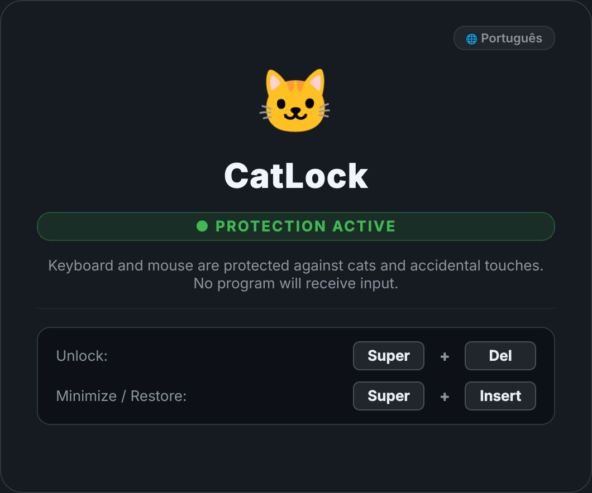

# 🐱 CatLock for Wayland & Linux

> **[Leia em Português](README.pt-BR.md)**

A modern, elegant, and secure keyboard and mouse locker for **Wayland** (and X11) desktop environments, optimized for **KDE Plasma** on Linux.

Protect your computer from curious cats walking across your keyboard, young children, or accidental touches—while keeping your screen completely visible (ideal for watching videos, reading, or stepping away).

<p align="center">
  
</p>

---

## ✨ Features

- **🐾 Full Input Protection:** Blocks and absorbs **all keyboard keystrokes and mouse clicks** (including left, right, double-click, and scroll wheel).
- **🛡️ 100% Safe (No Root/Sudo):** Unlike kernel-level `evdev` grabbing, CatLock runs entirely in user-space using PySide6 (Qt6). It will never crash your compositor or leave modifier keys stuck in Wayland.
- **🎨 Modern HUD Design:**
  - Sleek dark overlay with **rounded screen corners** and subtle glowing borders.
  - Responsive, compact central card with cat mascot and status indicator.
  - **Interactive Paw Feedback:** Pressing any key or mouse button displays an animated paw alert (`🐾 Input blocked`) confirming that the event was safely intercepted.
- **🔒 Secure Unlock Shortcut:**
  - Exclusively unlocked with **`Super + Del`** (or **`Command + Del`**).
  - Because `Super` (bottom-left) and `Del` (top-right) are on opposite diagonal corners of the keyboard, it is physically impossible for a cat lying or stepping on the keyboard to unlock it.
- **🎬 Movie/Video Mode (Minimize & Protect):**
  - Press **`Super + Insert`** to hide the card and dimming overlay. The screen becomes 100% visible for watching movies or streams while keyboard and mouse inputs remain completely blocked. Press **`Super + Insert`** again to restore the card.
- **🌐 Bilingual (EN / PT-BR):**
  - Instant language switching with a single click on the `🌐 Language` button.
  - Remembers your language preference in `~/.config/catlock/config.json`.
  - Supports `--lang en` and `--lang pt` CLI options.
- **🖥️ Wayland & KDE Plasma Native:**
  - Uses D-Bus (`org.kde.KGlobalAccel.blockGlobalShortcuts`) to temporarily disable system hotkeys (like standalone `Super` or `Alt+Tab`) while locked.
  - Automatically covers all connected monitors.

---

## 🚀 Installation & Requirements

### Requirements
- **Python 3.10+**
- **PySide6** (Qt 6 for Python)
- **python-dbus** (for KDE Plasma shortcut blocking)

On Arch Linux / CachyOS:
```bash
sudo pacman -S python python-pyside6 python-dbus
```

On Fedora:
```bash
sudo dnf install python3 python3-pyside6 python3-dbus
```

On Ubuntu / Debian:
```bash
sudo apt install python3 python3-pyside6 python3-dbus
```

### Clone the Repository
```bash
git clone https://github.com/brunolmadeira/catlock-wayland.git
cd catlock-wayland
chmod +x catlock.py catlock-wrapper.sh
```

### Optional: Add to PATH (Recommended)
You can link the wrapper to `~/.local/bin` so you can call `catlock` from anywhere:
```bash
mkdir -p ~/.local/bin
ln -sf "$(pwd)/catlock-wrapper.sh" ~/.local/bin/catlock
```
*(Ensure `~/.local/bin` is in your `$PATH`)*

---

## ⌨️ Setting up the Shortcut in KDE Plasma

1. Open **System Settings > Keyboard > Shortcuts**.
2. Click **Add New > Command...**
3. Set the name to **CatLock** and the command to:
   - If linked to PATH: `catlock`
   - Or full path: `/path/to/catlock-wayland/catlock-wrapper.sh`
4. Assign the global shortcut to **`Meta+Del`** (`Super + Del`).
5. Click **Apply**.

Now, pressing **Super + Del** toggles CatLock on and off seamlessly!

---

## 🕹️ Usage

### From Terminal or Shortcut
```bash
# Launch CatLock (or toggle off if already running)
./catlock-wrapper.sh

# Force specific language
python3 catlock.py --lang en
python3 catlock.py --lang pt
```

### While Locked
- **Click anywhere / press any key:** Input is ignored and an interactive `🐾` notification appears.
- **Switch Language:** Click the `🌐` button on the card to switch between English and Portuguese anytime.
- **Minimize / Restore:** Press **`Super + Insert`** to hide the card and dimming (ideal for videos) while retaining full input lock. Press again to restore.
- **Unlock:** Press **`Super + Del`** (or `Command + Del`).

---

## 📜 Acknowledgements & References

- **[lottev1991/catlock-wayland](https://github.com/lottev1991/catlock-wayland)**: **Primary inspiration** for this project. While the original script explored Wayland keyboard locking using raw `evdev` grabbing in the terminal, this project was rebuilt from the ground up using PySide6 (Qt6) to provide a safe, crash-proof graphical overlay with mouse protection, multi-monitor coverage, video/presentation mode, and bilingual support.
- **[rafalcieslak/catlock](https://github.com/rafalcieslak/catlock)**: Explored for study and reference on X11 keyboard locking mechanisms.
- **[sophice/ahk-keyboard-locker](https://github.com/sophice/ahk-keyboard-locker)**: Explored for study and reference on Windows/AutoHotkey implementations.

---

## 📄 License

This project is licensed under the [MIT License](LICENSE.md).