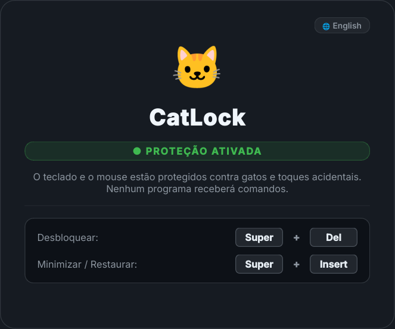

# 🐱 CatLock para Wayland & Linux

> **[Read in English](README.md)**

Um bloqueador de teclado e mouse moderno, elegante e seguro para ambientes **Wayland** (e X11), otimizado para o **KDE Plasma** no Linux.

Proteja seu computador contra gatos caminhando pelo teclado, crianças pequenas ou toques acidentais — mantendo sua tela totalmente visível (ideal para assistir vídeos, ler ou se afastar do PC temporariamente).

<p align="center">
  
</p>

---

## ✨ Recursos

- **🐾 Bloqueio Total de Entrada:** Bloqueia e absorve **todas as teclas do teclado e cliques do mouse** (incluindo botão esquerdo, direito, clique duplo e roda de rolagem).
- **🛡️ 100% Seguro (Sem Root/Sudo):** Diferente da interceptação por `evdev` no nível do kernel, o CatLock roda inteiramente em espaço de usuário via PySide6 (Qt6). Ele nunca causará crash no compositor nem deixará modificadores presos no Wayland.
- **🎨 Design Moderno com Bordas Arredondadas:**
  - Sobreposição escura com **bordas arredondadas na tela inteira** e contorno suave iluminado.
  - Card central compacto e responsivo, com ícone de gato e indicador de status.
  - **Feedback Interativo de Pata:** Ao pressionar qualquer tecla ou botão do mouse, surge um aviso animado de patinha (`🐾 Entrada bloqueada`) confirmando que o comando foi ignorado com segurança.
- **🔒 Atalho Seguro de Desbloqueio:**
  - Desbloqueio exclusivo via **`Super + Del`** (ou **`Command + Del`**).
  - Como o `Super` (canto inferior esquerdo) e o `Del` (canto superior direito) ficam em extremidades opostas do teclado, é fisicamente impossível para um gato acionar o desbloqueio por acidente ao deitar no teclado.
- **🎬 Modo Vídeo / Assistir (Minimizar sem Desproteger):**
  - Pressione **`Super + Insert`** para ocultar o card e o escurecimento da tela. A tela fica 100% visível e desobstruída para assistir vídeos ou streams, mantendo todo o teclado e mouse bloqueados. Pressione **`Super + Insert`** novamente para restaurar o card.
- **🌐 Bilíngue (Português / Inglês):**
  - Alterne o idioma instantaneamente clicando no botão `🌐` no card.
  - Salva sua preferência automaticamente em `~/.config/catlock/config.json`.
  - Suporta os parâmetros `--lang pt` e `--lang en` via linha de comando.
- **🖥️ Integração Nativa com Wayland & KDE Plasma:**
  - Usa D-Bus (`org.kde.KGlobalAccel.blockGlobalShortcuts`) para desativar temporariamente atalhos globais do sistema (como a tecla `Super` avulsa ou `Alt+Tab`) enquanto bloqueado.
  - Cobre automaticamente múltiplos monitores.

---

## 🚀 Instalação e Requisitos

### Requisitos
- **Python 3.10+**
- **PySide6** (Qt 6 para Python)
- **python-dbus** (para bloqueio de atalhos globais no KDE)

No Arch Linux / CachyOS:
```bash
sudo pacman -S python python-pyside6 python-dbus
```

No Fedora:
```bash
sudo dnf install python3 python3-pyside6 python3-dbus
```

No Ubuntu / Debian:
```bash
sudo apt install python3 python3-pyside6 python3-dbus
```

### Clonando o Repositório
```bash
git clone https://github.com/brunolmadeira/catlock-wayland.git
cd catlock-wayland
chmod +x catlock.py catlock-wrapper.sh
```

---

## ⌨️ Configurando o Atalho no KDE Plasma

1. Abra **Configurações do Sistema > Teclado > Atalhos**.
2. Clique em **Adicionar novo > Comando...**
3. Defina o nome como **CatLock** e o comando para:
   ```bash
   /caminho/para/catlock-wayland/catlock-wrapper.sh
   ```
4. Defina o atalho global como **`Meta+Del`** (`Super + Del`).
5. Clique em **Aplicar**.

Agora, pressionar **Super + Del** alterna entre ativar e desativar o CatLock instantaneamente!

---

## 🕹️ Como Usar

### Pelo Terminal ou Atalho
```bash
# Inicia o CatLock (ou encerra se já estiver rodando)
./catlock-wrapper.sh

# Força um idioma específico
python3 catlock.py --lang pt
python3 catlock.py --lang en
```

### Durante o Bloqueio
- **Clicar em qualquer lugar ou pressionar qualquer tecla:** A entrada é ignorada e a notificação de patinha `🐾` aparece.
- **Trocar de Idioma:** Clique no botão `🌐` no card a qualquer momento para alternar entre Português e Inglês.
- **Minimizar / Restaurar:** Pressione **`Super + Insert`** para ocultar o card e o escurecimento (ideal para vídeos) enquanto mantém tudo 100% bloqueado. Pressione novamente para reexibir.
- **Desbloquear:** Pressione **`Super + Del`** (ou `Command + Del`).

---

## 📜 Créditos e Referências

Este projeto foi inspirado e baseado inicialmente em:
- **[lottev1991/catlock-wayland](https://github.com/lottev1991/catlock-wayland)**: Projeto de referência original para bloqueio de teclado no Wayland. Esta versão reformulou completamente a arquitetura, substituindo a captura de baixo nível via `evdev` com terminal aberto por uma interface gráfica segura em PySide6/Qt6 com bloqueio de mouse, bordas arredondadas e suporte multilíngue.
- **[rafalcieslak/catlock](https://github.com/rafalcieslak/catlock)**: Para usuários do X11.
- **[sophice/ahk-keyboard-locker](https://github.com/sophice/ahk-keyboard-locker)**: Para usuários do Windows (AutoHotkey).

---

## 📄 Licença

Distribuído sob a licença [MIT](LICENSE.md).
